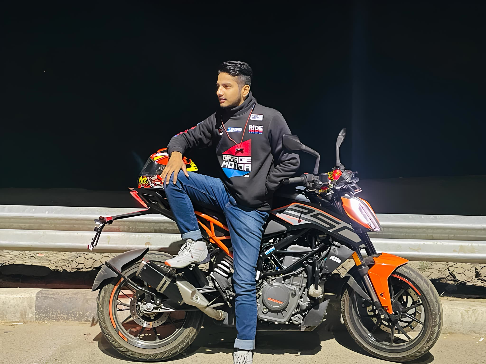
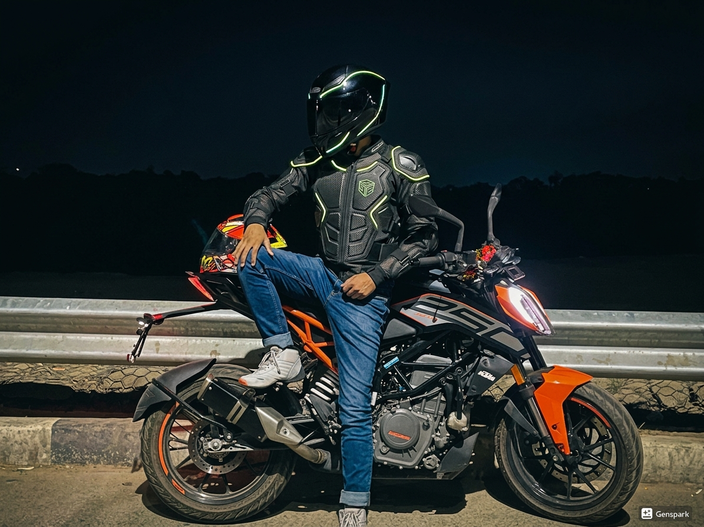
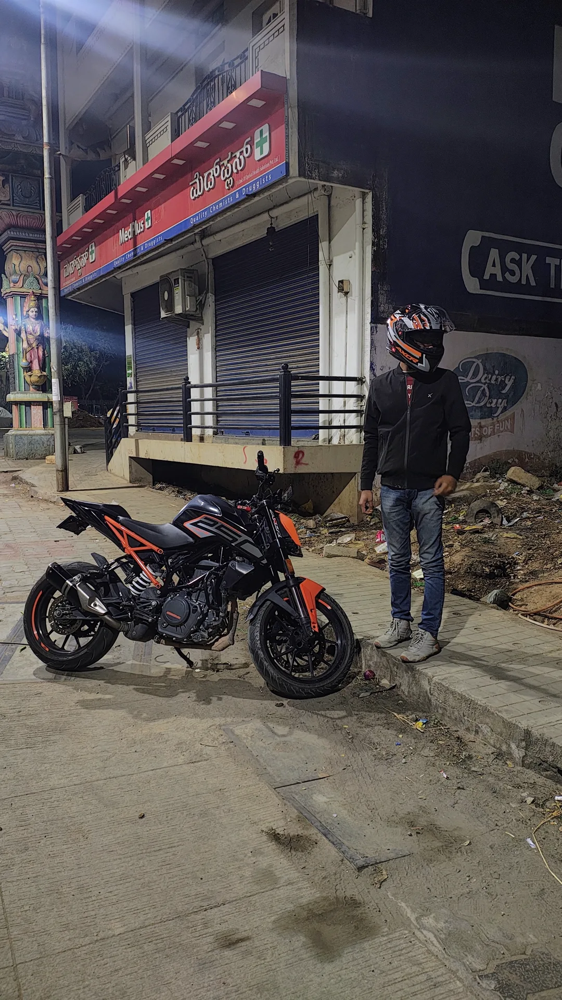
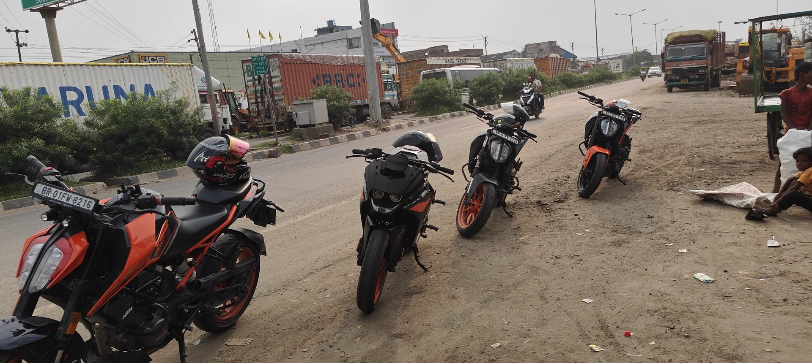

<div align="center">

# RT•MOTO

### REDEFINING LIMITS

**A cinematic, interactive WebGL portfolio on the duality of identity — the rider behind the engineer.**


[**Live Experience**](https://rt-moto.vercel.app/) · [Signature Interaction](#02--signature-interaction--the-liquid-reveal) · [Architecture](#05--architecture)



</div>

---

## 00 // OVERVIEW

RT•MOTO is the front page of a developer who treats the browser as a circuit. It is a single-narrative,
scroll-driven experience built around one idea — the shift from **human to rider** — and engineered to hold
60 FPS while it tells that story. Equal parts interaction design and performance engineering, it ships as
**v1.0.0** and is feature-complete: a finished, production-deployed showpiece rather than a work in progress.

> Read it two ways — skim the headings for *what was built*, or read the bodies for *how it was built*.

---

## 01 // CONCEPT — THE RIDER BEHIND THE ENGINEER

Most portfolios list work. RT•MOTO **performs** an idea: that the person who writes the code and the rider
who chases an apex are the same momentum in two states. The whole site is a controlled investigation of that
duality — static identity giving way to mechanical identity — expressed through a restrained, brutalist
motorsport language: near-black canvas, a single lime accent (`#D2FF00`), wide display type, and telemetry
typography. Nothing decorative. Every effect earns its frame time by serving the narrative.

---

## 02 // SIGNATURE INTERACTION — THE LIQUID REVEAL

The hero is a **single GPU pass** that holds two photographs in perfect register and dissolves between them
with liquid.

| Texture | State |
| :--- | :--- |
| `base.jpg` | **The human** — helmet off, grounded, identifiable. |
| `reveal.jpg` | **The rider** — helmet on, anonymous, in motion. |

Both images are sampled at **identical `object-fit: cover` UVs**, so the helmet lands exactly on the head —
the reveal swaps identity *in place* and never shifts the frame (the canvas is matched pixel-for-pixel to the
LCP `` underneath it).

The liquid itself is a **metaball field**, blended from two sources:

- **Autonomous fluid cells** flow continuously across the frame, advected by a **curl-noise (divergence-free)
  flow field** — organic, never-repeating motion that owes nothing to the cursor.
- A **cursor-driven gooey trail** follows the pointer with weighted lag and a soft, receding wake. It fuses
  with the autonomous cells through an inverse-square metaball sum and a tight `smoothstep` — gooey necks,
  noise-warped organic edges.

Restraint is the point: **no chromatic aberration, no glitch, no grain over the photograph.** The image is
never distorted — only the *mask boundary* is. When the visitor prefers reduced motion, the WebGL layer is
skipped entirely and a crisp still photograph is served instead.

---

## 03 // FEATURE HIGHLIGHTS

- **The Liquid Reveal** — the dual-texture metaball hero described above.
- **Tachometer Boot** — a redline loading sequence (`SYSTEM INIT → CALIBRATING → IGNITION`) driven by real
  R3F asset progress, not a fake timer.
- **Choreographed Motion System** — GSAP + ScrollTrigger orchestrate the page as one continuous sequence,
  with **Lenis** smoothing the scroll and a single source of truth for every ease, duration, and stagger.
- **Gear Check — 3D Helmet Telemetry** — a pinned, scroll-scrubbed camera choreography around a
  `DamagedHelmet` GLB (boot → scan → calibrate → ignite → lock) with a booting HUD; R3F reads a plain scroll
  state object, so it animates with **zero React re-renders**.
- **Grid Archive** — a dedicated route with a masonry-style log grid, scramble-text labels, deep parallax, and
  a keyboard-navigable lightbox.
- **Editorial Atmosphere** — film-grain overlays, marquee tickers, and scan reveals across the lower sections
  give it the feel of a premium print publication.
- **Accessible by default** — honors `prefers-reduced-motion` and caps device-pixel-ratio on touch hardware.

---

## 04 // PERFORMANCE ENGINEERING

Performance is treated with the same rigor as the creative direction — the target is a steady **60 FPS on
mid-tier mobile**.

- **Manual chunk splitting** — Three.js, GSAP, and React are isolated into separate vendor chunks to optimize
  caching and shrink the initial execution bottleneck.
- **On-demand rendering** — every WebGL frameloop is gated by `IntersectionObserver`; canvases drop to
  `frameloop="demand"` the instant they scroll off-screen, freeing the GPU.
- **Lazy pipeline** — all below-the-fold sections are async modules; the hero texture is prioritized via an
  LCP ``, `fetchpriority="high"`, and a preload.
- **Zero-rerender interaction** — high-frequency data (pointer position, scroll velocity) lives *outside*
  React in module scope and Zustand transient subscriptions, keeping interaction latency negligible.

---

## 05 // ARCHITECTURE

A clean engineering system that separates visual presentation from motion orchestration and state.

```text
src/
├── components/
│   ├── layout/     # Persistent shell — Navbar, Footer, Loader (tachometer boot)
│   ├── sections/   # Narrative modules — Hero, TheMachine, Helmet, Rides, StatReveal, Story…
│   ├── ui/         # Reusable primitives — Marquee, ScanReveal, ScopeReveal, scramble text
│   └── webgl/      # R3F layers — HeroShaderMesh (the reveal), FluidBackground, BackgroundOrb
├── shaders/        # GLSL — heroFragment / heroVertex (reveal) · fluidFragment (background)
├── motion/         # system.js — the single source of eases, durations, staggers, scroll weights
├── store/          # Zustand multi-store — useStore (transient), useUIStore
├── hooks/          # Reusable logic — useParallax, interaction observers
├── pages/          # Routed views — Home, Archive (React Router)
├── data/           # media.js — one content source for the whole site
└── utils/          # Integrations — Lenis (smooth scroll), scramble engine
```

---

## 06 // TECH STACK

| Layer | Technologies |
| :--- | :--- |
| **Frontend** | React 19, Vite 8, Tailwind CSS 4, React Router 7 |
| **Motion** | GSAP 3 · ScrollTrigger · Lenis (smooth scroll) |
| **3D / Graphics** | Three.js (r184) · React Three Fiber · drei · GLSL (`vite-plugin-glsl`) |
| **State** | Zustand 5 |
| **Icons** | lucide-react |
| **Infrastructure** | Vercel · Speed Insights · Analytics |

---

## 07 // GETTING STARTED

```bash
# Clone the repository
git clone https://github.com/RTiwari-06/rt-moto.git
cd rt-moto

# Install dependencies
npm install

# Start local development (Vite, host-exposed)
npm run dev

# Build for production
npm run build

# Preview the production build
npm run preview
```

---

## 08 // RESPONSIVE & ACCESSIBILITY

Mobile is a first-class target, not an afterthought.

- **Touch philosophy** — hover-only reveals degrade gracefully; the experience leans on scroll-driven state on
  touch devices.
- **Reduced motion** — `prefers-reduced-motion` skips the canvas and animation entirely, serving the still
  photograph so the page is calm and instant.
- **Thermal management** — device-pixel-ratio is capped on coarse pointers and off-screen frameloops are
  culled, keeping mobile GPUs cool.

---

## 09 // SHOWCASE


*Fig 1. The Liquid Reveal — human ↔ rider.*


*Fig 2. Gear Check — scroll-scrubbed 3D helmet telemetry.*


*Fig 3. The Grid Archive.*

---

## 10 // POST-1.0 EVOLUTION

v1.0.0 is complete and shipped. Directions under consideration beyond it:

- [ ] **Immersive Audio** — engine-frequency-driven spatial sound.
- [ ] **Asset Upgrades** — high-fidelity 4K texture streaming.
- [ ] **Gesture Navigation** — refined tablet/trackpad interactions.
- [ ] **Live Telemetry** — dynamic, data-driven race-day content.

---

## 11 // CREDITS

**Creative Direction & Engineering** — [Raj Tiwari](https://github.com/RTiwari-06)

*Bengaluru, India // 2026*

<div align="center">

---

**RT•MOTO // SYSTEM NOMINAL · v1.0.0**

</div>
